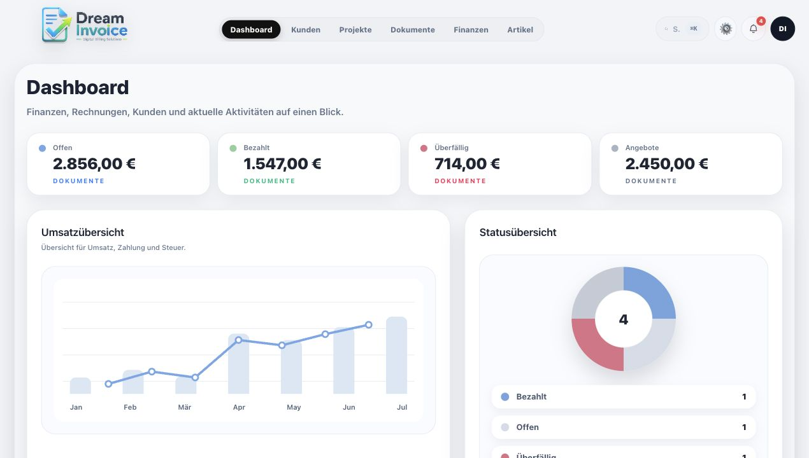
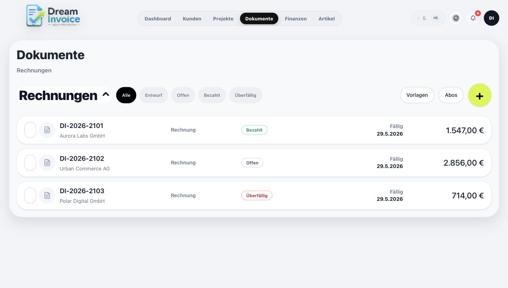
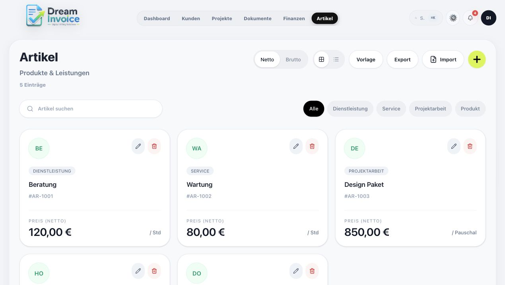

## Dream Invoice

[](https://github.com/dream-de/invoice-app/actions/workflows/ci.yml)


---

Dream Invoice is a modern invoicing and business management platform for self-hosted teams, freelancers, and small companies. It helps manage invoices, offers, customers, articles, projects, finance workflows, document templates, PDF generation, exports, user roles, and operational settings in one focused workspace.

The application can be used as a self-hosted web app and includes an isolated public demo environment for evaluation.

> **Note:** Dream Invoice is currently in active development. Some features, workflows, and UI details may still change before the first stable release. Feedback and issue reports are welcome.

## Live Demo

Demo: [http://demo.dream-invoice.com:3001](http://demo.dream-invoice.com:3001)

Demo access:

- Email: `demo@example.com`
- Password: `dreaminvoice`

All demo data is fictional. Changes are simulated and are not saved permanently.







## Features

- Invoices, offers, documents, DIN A4 preview, PDF export, and visual templates
- Customers, articles, projects, finance workflows, import/export, and reporting
- Multi-language app shell, login/session protection, licensing, and user-limit enforcement
- Product Docker stack with PostgreSQL, web app, health checks, optional proxy, and optional worker
- Optional demo and landing page kept separate from product/LXC installs

## GoBD-Oriented Workflows

Dream Invoice provides technical building blocks for traceable business workflows, including role-based access, audit logging, document history, PDF generation, and structured exports such as CSV.

GoBD readiness depends on the concrete deployment, operating procedures, retention policy, user roles, backup strategy, country-specific requirements, and tax advisor review. Dream Invoice does not claim official tax-authority certification.

## Workspace

- `apps/web`: main product web app
- `apps/demo`, `apps/landing-page`: optional demo and product website
- `apps/server-worker`, `apps/server-api`, `apps/admin`, `apps/accounting`: service and companion apps
- `apps/desktop`, `apps/pro-desktop`, `packages/desktop-*`: separated desktop and Pro workspaces
- `packages/database`, `packages/ui`, `packages/licensing`, `packages/accounting-core`: shared data, UI, licensing, and domain logic
- `docker/`, `docs/`, `tools/license/`: deployment, documentation, and license tooling

## Getting Started

For a fresh self-hosted LXC or server, install Docker first, then run:

```bash
cd /
git clone https://github.com/dream-de/invoice-app.git dream-invoice.com
cd /dream-invoice.com
cp .env.example .env
nano .env
```

Start the stack:

```bash
docker compose up -d
```

The default product stack starts PostgreSQL and the Dream Invoice web app. Open the app at `http://SERVER-IP:3000`. The optional Nginx proxy is available through the `proxy` profile when you want port 80, a domain, or HTTPS in front of the app.

---

Default access for the first test start:

- User: `admin`
- Password: the value of `DREAM_INVOICE_AUTH_PASSWORD` in your `.env`

---

Before real production use, change all default passwords and secrets in `.env`, especially the values below:

- `AUTH_SECRET`
- `AUTH_COOKIE_SECURE` (set to `true` when the public app URL uses HTTPS)
- `POSTGRES_PASSWORD`
- `DREAM_INVOICE_AUTH_PASSWORD`
- `DREAM_INVOICE_ADMIN_PASSWORD`

---

## Install With Auto-Generated Secrets

If you want the installer to create random secrets automatically, use:

```bash
cd /
git clone https://github.com/dream-de/invoice-app.git dream-invoice.com
cd /dream-invoice.com
chmod +x scripts/install.sh scripts/status.sh
./scripts/install.sh
```

The installer creates a local `.env` file with generated secrets, starts the same product Docker stack, and prints the generated deployment password.

After installation, check the stack:

```bash
./scripts/status.sh
```

## Development Setup

Install dependencies and generate the Prisma client:

```bash
pnpm install
pnpm db:generate
```

Start the main web app locally:

```bash
pnpm dev:web
```

The app will be available at:

```text
http://localhost:3000
```

## Project Documentation

- [Production Deployment](./docs/deployment/production.md)
- [Production Checklist](./docs/deployment/production-checklist.md)
- [Operations Runbook](./docs/operations/runbook.md)
- [Testing](./docs/testing.md)
- [Releasing](./docs/releasing.md)
- [Security Policy](./SECURITY.md)
- [Secrets Rotation](./docs/security/secrets-rotation.md)
- [Audit Log](./docs/security/audit-log.md)
- [Roadmap](./ROADMAP.md)
- [App Structure](./docs/architecture/app-structure.md)
- [PDF Tools](./docs/pdf-tools.md)
- [Contributing](./CONTRIBUTING.md)
- [Support](./SUPPORT.md)
- [Code of Conduct](./CODE_OF_CONDUCT.md)

## Developer Reference

Most users only need the quick install above. The commands below are kept for maintainers and advanced self-hosted setups.

<details>
<summary>Common development commands</summary>

```bash
pnpm dev                 # Start all development tasks through Turbo
pnpm dev:web             # Start the main web app
pnpm dev:admin           # Start the admin app
pnpm dev:accounting      # Start the accounting app
pnpm dev:server          # Start the server app
pnpm build               # Run all build tasks
pnpm lint                # Run linting for apps and packages
pnpm typecheck           # Run TypeScript checks for apps and packages
pnpm test                # Run tests for apps and packages
pnpm db:generate         # Generate the Prisma client
pnpm db:migrate          # Run local database migrations
pnpm db:deploy           # Run deployment migrations
pnpm db:studio           # Open Prisma Studio
pnpm worker:server       # Run the server worker locally
pnpm worker:server:smoke # Run the worker smoke test
pnpm release:check       # Run release checks
pnpm release:quality     # Run full local release quality gates
pnpm security:audit      # Run dependency audit from pnpm
```

</details>

<details>
<summary>Docker commands</summary>

Start the product Docker stack manually. Use `--build` when you want to force a fresh image build. This starts Dream Invoice and PostgreSQL. Demo and landing-page services are handled by their own stack:

```bash
docker compose up -d
```

The web app is available on port `3000`. To also start the optional Nginx proxy on port `80`, run:

```bash
docker compose --profile proxy up -d
```

Check status and logs:

```bash
docker compose ps
docker compose logs -f
```

Check the database:

```bash
docker compose exec postgres pg_isready -U dream_invoice -d dream_invoice
```

Rebuild the stack:

```bash
docker compose build --no-cache
docker compose up -d
```

Build or run the worker profile:

```bash
pnpm docker:build:worker
pnpm docker:worker
```

Run the optional website stack separately when you host the marketing site and demo:

```bash
pnpm docker:public:up
pnpm docker:public:logs
```

The website stack uses `docker/public-site.compose.yml` and uses `PUBLIC_HTTP_PORT` instead of joining the product installation.

</details>

<details>
<summary>Development Docker helpers</summary>

Start local development services only:

```bash
pnpm docker:dev:up
```

This starts PostgreSQL, Mailpit, and Adminer for local development without sending real emails.

- PostgreSQL: `127.0.0.1:55433`
- Mailpit SMTP: `127.0.0.1:1025`
- Mailpit inbox: `http://localhost:8025`
- Adminer: `http://localhost:8081`

Use `docker/development/.env.example` as the template for custom local ports or credentials. For deployment, adjust the environment values and follow [Production Deployment](./docs/deployment/production.md).

```bash
pnpm docker:dev:ps
pnpm docker:dev:logs
pnpm docker:dev:down
```

</details>

<details>
<summary>Backup and restore</summary>

Create a database backup:

```bash
docker compose exec postgres pg_dump -U dream_invoice dream_invoice > backup.sql
```

Restore a database backup:

```bash
cat backup.sql | docker compose exec -T postgres psql -U dream_invoice dream_invoice
```

</details>

## License

This project is source-available and may be used, installed, and modified for private, non-commercial purposes. Commercial use, resale, paid hosting, redistribution, or use in client projects is not permitted without explicit written permission from the author.

Copyright (c) 2026 DikiTe. All rights reserved. See [LICENSE](./LICENSE).

## License Tools

License key generation, security rules, and technical license workflows are documented in [tools/license](./tools/license/README.md).
